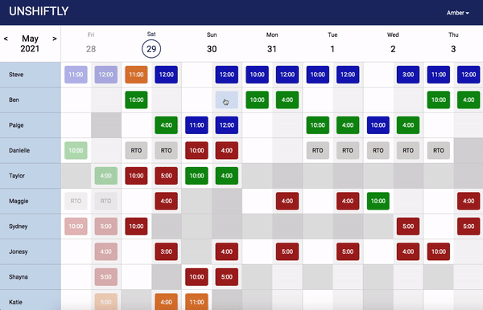
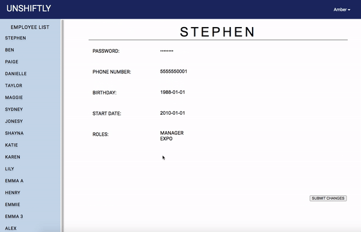

# [Unshiftly](http://ec2-18-215-167-152.compute-1.amazonaws.com/) #

## Scheduling Made Easy ##
  > Unshiftly is designed to help restaurants and other food service industry businesses organize their workforce schedule.

<br/>

## Authors: ##

> James Carter - [GitHub](https://github.com/jameslesliecarter) | [LinkedIn](https://www.linkedin.com/in/james-leslie-carter/) | [jameslesliecarter@gmail.com](mailto:jameslesliecarter@gmail.com?subject=[GitHub]%20Unshiftly)<br>
> Ramisa Chowdhury - [GitHub](https://github.com/rrchow97) | [LinkedIn](https://www.linkedin.com/in/ramisachowdhury/) | [rrchow97@gmail.com](mailto:rrchow97@gmail.com?subject=[GitHub]%20Unshiftly)<br>
> Tyler Moniz - [GitHub](https://github.com/ZinomT) | [LinkedIn](https://www.linkedin.com/in/tylermoniz/) | [tmgnbvt@gmail.com](mailto:tmgnbvt@gmail.com?subject=[GitHub]%20Unshiftly)<br>
> Amber Morris - [GitHub](https://github.com/amberMorris97) | [LinkedIn](https://www.linkedin.com/in/amber-morris-8a5883101/) | [ambermorris1997@gmail.com](mailto:ambermorris1997@gmail.com?subject=[GitHub]%20Unshiftly)<br>
> Ryan Pannone - [GitHub](https://github.com/Rpannone88) | [LinkedIn](https://www.linkedin.com/in/ryan-pannone/) | [rpannone88@gmail.com](mailto:rpannone88@gmail.com?subject=[GitHub]%20Unshiftly)<br>
> Tomas Rodriguez - [GitHub](https://github.com/tomrod10) | [LinkedIn](https://www.linkedin.com/in/tomas-rodriguez-al/) | [tomrod243.com](mailto:tomrod243@gmail.com?subject=[GitHub]%20Unshiftly)

<br>

## Overview ##
  > A client tasked us with developing a web app with capabilities to provide himself and his employees with the ability to keep track of weekly scheduling. He was struggling with juggling all the individual employee's shifts and requests for time off on daily basis.
  <br/><br/>
  We developed a CRUD appliction withh a RESTful API allowing administrative users to successfully read and write schedules weekly. Along with the ability for non-administrators to view only their particular schedules and pick up shifts that their coworkers have dropped. This was done by adding single-step authentication in the form of Passport.js and Bcrypt.

<br/>

<!-- ## General Calendar Page ## -->
<!--  -->

## Edit Schedule Page ##


## Edit Employees Page ##


## Testimonial ##
  >"Exactly what I was looking for from your team. You output impressive work in a short span of time. It was a pleasure working with you!" - Stephen

<br/>

## Feel free to reach out to any of the former developers to get more information on the application.

<br/>

# Technogies Used #
Database <br/>
>MySQL <br/>
>Node MySQL2 <br/>

Server <br/>
>Node <br/>
>Express <br/>

Front End <br/>
>React <br/>
>Redux <br/>

Authentication <br/>
>Passport.js <br/>
>Bcrypt<br/>

Middleware <br/>
>Axios <br/>
>Thunk <br/>

Deployment <br />
>Docker <br/>
>Amazon Web Services <br/>

<br/>

# Setup #

Download [Node.js](https://nodejs.org/en/download/). <br>
Run the following commands in terminal:

``` bash
# Clone the repo
git clone https://github.com/Blue-Himalaya/unshiftly.git

# Change directory into unshiftly
cd unshiftly

# Install dependencies (only the first time)
npm install

# Build the client side
npm run build

# Run the local server at localhost:8080
npm start
```

Open a browser and go into http://localhost:8080/ <br/>

Username: Coming Soon  <br/>
Password:  Coming Soon


